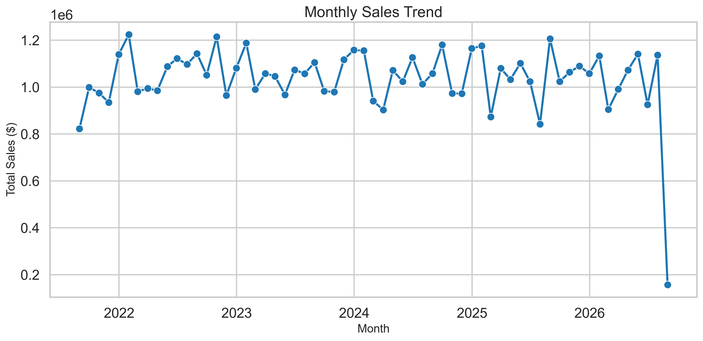
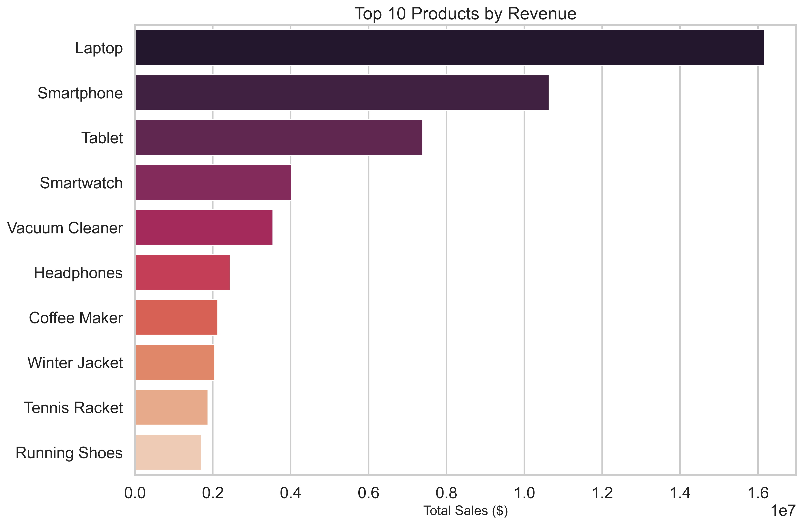
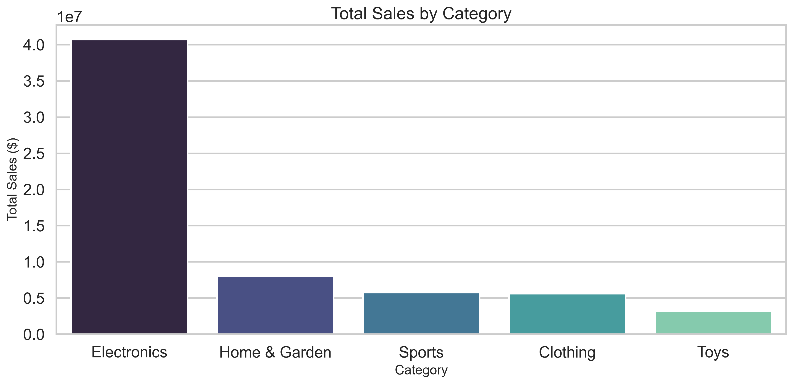
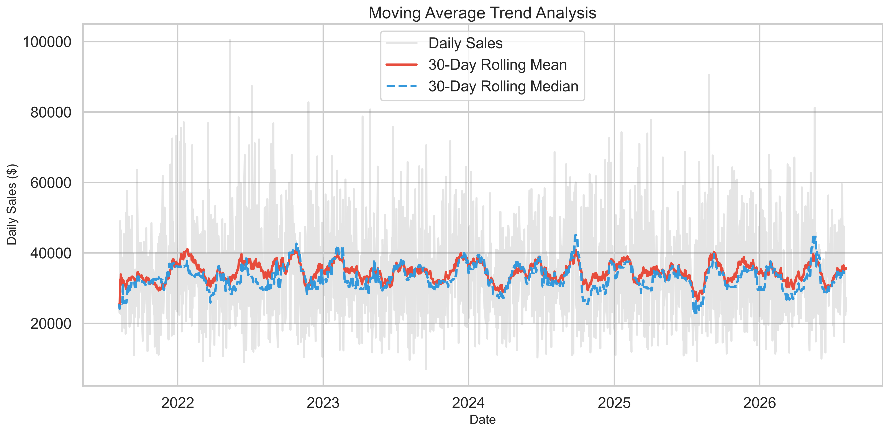
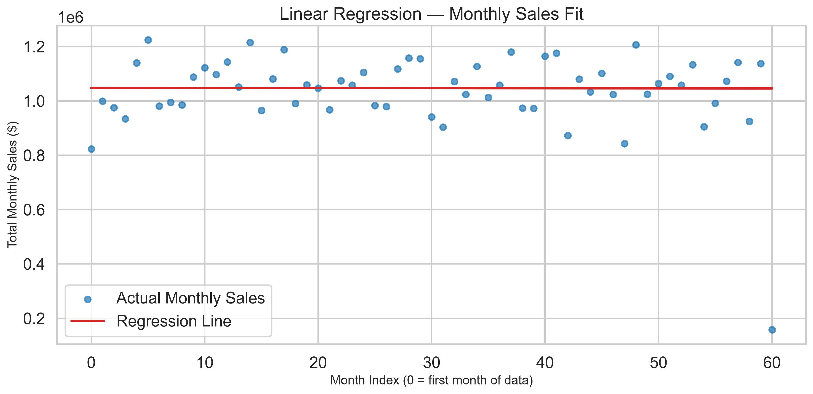

<div align="center">

# 📊 Sales Data Analyzer Pro

### Production-Grade Retail Sales Analytics & Forecasting Platform

[](https://www.python.org/)
[](https://pandas.pydata.org/)
[](https://scikit-learn.org/)
[](https://streamlit.io/)
[](https://plotly.com/)
[](LICENSE)

> A complete, real-world Python data analytics application that cleans retail sales data, generates deep business insights, produces professional visualisations, predicts future revenue using Machine Learning, and exports a multi-page PDF report — all accessible through a Power BI-style interactive web dashboard.

</div>

---

## 📌 Table of Contents

- [Project Description](#-project-description)
- [Key Features](#-key-features)
- [Screenshots](#-screenshots)
- [Architecture](#-architecture)
- [Folder Structure](#-folder-structure)
- [Installation](#-installation)
- [Requirements](#-requirements)
- [How to Run](#-how-to-run)
  - [Interactive CLI](#1-interactive-cli-menu)
  - [Automated Pipeline](#2-automated-pipeline-mode)
  - [Web Dashboard](#3-web-dashboard)
- [Module Reference](#-module-reference)
- [Dataset](#-dataset)
- [Machine Learning](#-machine-learning)
- [PDF Report](#-pdf-report)
- [Future Improvements](#-future-improvements)
- [Contributing](#-contributing)
- [License](#-license)

---

## 📖 Project Description

**Sales Data Analyzer Pro** is a portfolio-quality, production-ready Python application built for a retail company scenario. The company has five years of historical sales data stored in CSV files and needs a complete analytics platform that:

- **Cleans** raw, noisy data automatically
- **Analyzes** sales performance across time, region, product, and category
- **Visualizes** trends using professional charts (interactive + static)
- **Forecasts** next month's and next quarter's revenue using Scikit-Learn
- **Reports** all findings in a professional, multi-page PDF document
- **Presents** everything through a dark-themed, Power BI-style Streamlit dashboard

This project demonstrates real-world software engineering practices including clean architecture, OOP design, PEP-8 compliance, modular code, comprehensive logging, exception handling, and professional documentation.

---

## ✨ Key Features

### Data Generation
- Generates **50,000 realistic retail sales records** spanning 5 years
- Products belong to accurate categories with realistic price ranges
- Intentional data quality issues injected for the cleaning module to resolve

### Data Cleaning (`src/cleaning.py`)
- Removes duplicate rows
- Handles missing values (categorical → `Unknown`, numeric → median)
- Fixes invalid / unparseable dates
- Converts all columns to correct data types
- Removes negative sales, costs, and impossible numeric values
- Recalculates derived columns (`Sales`, `Profit`) for data integrity
- Displays a structured **Cleaning Summary Report**
- Logs every transformation step

### Sales Analysis (`src/analysis.py`)
- Daily, Weekly, Monthly, Quarterly, Yearly sales aggregations
- Region-wise, Category-wise, Product-wise sales DataFrames
- Customer spending analysis
- Average Order Value
- Month-over-Month growth percentage
- Highest and Lowest sales months
- Best and Worst performing regions
- Exports 6 ranked CSV tables:
  - `top_5_products.csv`
  - `top_10_products.csv`
  - `most_profitable_products.csv`
  - `least_profitable_products.csv`
  - `highest_revenue_categories.csv`
  - `best_regions.csv`

### Visualizations (`src/visualization.py`)
Generates **11 professional, high-DPI (300 DPI) charts**:
| Chart | File |
|---|---|
| Monthly Sales Line Chart | `monthly_sales_line.png` |
| Quarterly Sales Bar Chart | `quarterly_sales_bar.png` |
| Category Sales Bar Chart | `category_sales_bar.png` |
| Region Sales Pie Chart | `region_sales_pie.png` |
| Top Products Horizontal Bar | `top_products_bar.png` |
| Correlation Heatmap | `correlation_heatmap.png` |
| Sales vs Profit Scatter Plot | `scatter_plot.png` |
| Sales Distribution Histogram | `histogram.png` |
| Profit Distribution | `profit_distribution.png` |
| Moving Average Trend | `moving_average_trend.png` |
| Regression + Prediction Graph | `regression_line.png`, `prediction_graph.png` |

### Machine Learning (`src/prediction.py`)
- **Scikit-Learn Linear Regression** model
- Chronological **80/20 Train/Test Split** (no data leakage)
- Displays: **MAE**, **RMSE**, **R² Score**, and Train/Test size
- Predicts **Next Month's Sales** and **Next Quarter's Revenue**
- Saves trained model to `models/sales_prediction_model.pkl` using Pickle
- Loads saved model automatically — no retraining required on restart

### PDF Report (`src/pdf_report.py`)
Professional multi-page PDF generated with **ReportLab**:
- Branded cover page with company name, date range, and timestamp
- Data Cleaning Summary table
- Executive Summary with KPI cards
- Monthly and Quarterly sales reports with embedded tables
- Top Products and Category rankings
- Regional Performance section
- Advanced chart embeds (scatter, heatmap, histogram, moving average)
- Machine Learning metrics and forecast table
- Data-driven Recommendations section
- Header, footer, page numbers, and generation timestamp on every page

### Web Dashboard (`dashboard.py`)
A professional **Power BI / Tableau-style** Streamlit dashboard with:
- **Dark theme** with custom CSS and branded sidebar
- **8-page navigation** via sidebar radio buttons
- **Company logo** placeholder in sidebar
- **Sidebar filters**: Date Range, Year, Quarter, Month, Region, Category, Product, Payment Method
- **Interactive Plotly charts** (line, bar, pie, scatter, heatmap, histogram, box)
- **KPI metric cards** with accent color bands
- **Download buttons** on every page (CSV, Excel, PDF)
- **Execution time** badge on every render

### CLI Interface (`main.py`)
- Professional ASCII banner
- Color-coded terminal output (Cyan, Green, Red, Yellow)
- Validated date range input with `YYYY-MM-DD` format
- Per-action execution timer
- Full exception handling for every menu option

---

## 📸 Screenshots

> **Dashboard — Main Overview**
>
> 

> **Top Products Chart**
>
> 

> **Category Revenue Breakdown**
>
> 

> **Moving Average Trend**
>
> 

> **ML Prediction — Regression Line**
>
> 

---

## 🏗️ Architecture

```
┌──────────────────────────────────────────────────┐
│                    main.py                        │
│          CLI Menu + Date Validation               │
└─────────┬────────────────────────────────────────┘
          │
          ├── src/utils.py          ← Data Generation
          ├── src/cleaning.py       ← Data Cleaning Pipeline
          ├── src/analysis.py       ← Business Analytics Engine
          ├── src/visualization.py  ← Chart Generation (Seaborn + Matplotlib)
          ├── src/prediction.py     ← ML Model (Scikit-Learn)
          ├── src/pdf_report.py     ← PDF Export (ReportLab)
          └── dashboard.py          ← Streamlit Web UI (Plotly)

                    ↓ reads from / writes to
          ┌─────────────────────────────────────┐
          │   config.py   ← Centralized paths   │
          │   data/       ← CSVs                │
          │   charts/     ← PNG images          │
          │   reports/    ← PDF reports         │
          │   models/     ← Pickle files        │
          │   logs/       ← Application logs    │
          └─────────────────────────────────────┘
```

---

## 📁 Folder Structure

```
Sales-Data-Analyzer/
│
├── data/
│   ├── sales_data.csv                    # Raw generated dataset (50,000 rows)
│   ├── cleaned_sales_data.csv            # Post-cleaning dataset
│   ├── summary_statistics.csv            # KPI summary
│   ├── top_5_products.csv
│   ├── top_10_products.csv
│   ├── most_profitable_products.csv
│   ├── least_profitable_products.csv
│   ├── highest_revenue_categories.csv
│   └── best_regions.csv
│
├── charts/                               # All generated PNG charts (300 DPI)
│
├── reports/
│   └── Sales_Report.pdf                  # Generated professional PDF
│
├── logs/
│   └── application.log                   # Full application log
│
├── models/
│   └── sales_prediction_model.pkl        # Trained Scikit-Learn model
│
├── src/
│   ├── utils.py                          # Dataset generator
│   ├── cleaning.py                       # Data cleaning module
│   ├── analysis.py                       # Analytics engine
│   ├── visualization.py                  # Chart generation
│   ├── prediction.py                     # ML forecasting module
│   └── pdf_report.py                     # PDF report generator
│
├── tests/
│   └── test_cleaner.py                   # Unit tests (unittest)
│
├── main.py                               # CLI entry point
├── dashboard.py                          # Streamlit web dashboard
├── config.py                             # Centralized configuration
├── requirements.txt                      # Python dependencies
└── README.md                             # This file
```

---

## ⚙️ Installation

### Prerequisites
- **Python 3.12+** ([download here](https://www.python.org/downloads/))
- **pip** (bundled with Python)
- **Git** ([download here](https://git-scm.com/))

### Step 1 — Clone the Repository

```bash
git clone https://github.com/your-username/Sales-Data-Analyzer.git
cd Sales-Data-Analyzer
```

### Step 2 — (Optional) Create a Virtual Environment

```bash
# Windows
python -m venv venv
venv\Scripts\activate

# macOS / Linux
python3 -m venv venv
source venv/bin/activate
```

### Step 3 — Install Dependencies

```bash
pip install -r requirements.txt
```

---

## 📦 Requirements

| Package | Version | Purpose |
|---|---|---|
| `pandas` | ≥ 2.0.0 | Data manipulation |
| `numpy` | ≥ 1.24.0 | Numerical operations |
| `matplotlib` | ≥ 3.7.0 | Static chart generation |
| `seaborn` | ≥ 0.12.0 | Statistical visualizations |
| `scikit-learn` | ≥ 1.2.0 | Machine Learning (Linear Regression) |
| `reportlab` | ≥ 4.0.0 | PDF generation |
| `streamlit` | ≥ 1.20.0 | Web dashboard framework |
| `plotly` | ≥ 5.15.0 | Interactive charts in dashboard |
| `openpyxl` | ≥ 3.1.0 | Excel export |

---

## 🚀 How to Run

### 1. Interactive CLI Menu

Launch the full interactive menu:

```bash
python main.py
```

You will see:

```
  +-------------------------------------------------+
  |          SALES DATA ANALYZER PRO                |
  |          Production v2.0                        |
  +-------------------------------------------------+

  ======================================================
    MAIN MENU
  ======================================================
    1.  Clean Data
    2.  Sales Analysis
    3.  Generate Charts
    4.  Show Top Products
    5.  Predict Future Sales
    6.  Generate PDF Report
    7.  Launch Web Dashboard
    8.  Run Full Pipeline
    9.  Exit
  ======================================================
  Select option (1-9) :
```

> **Tip:** Options 2–6 will ask for an optional date range filter. Press `Enter` to use the full dataset.

### 2. Automated Pipeline Mode

Run the entire pipeline non-interactively:

```bash
python main.py --run-all
```

With a date filter:

```bash
python main.py --run-all --start-date 2022-01-01 --end-date 2024-12-31
```

This executes all 5 steps in sequence:
1. Data Cleaning
2. Sales Analysis
3. Chart Generation
4. ML Prediction
5. PDF Report Generation

### 3. Web Dashboard

Launch the Streamlit dashboard in your browser:

```bash
python -m streamlit run dashboard.py
```

> The dashboard will open automatically at **http://localhost:8501**

**Dashboard Pages:**

| Page | Description |
|---|---|
| 📊 Dashboard | KPI cards, monthly trend, region pie, category bar |
| 🧹 Data Cleaning | Cleaning stats, data preview, CSV/Excel download |
| 📈 Sales Analysis | Time series, regional, category, customer tabs |
| 🖼️ Visualizations | Distributions, correlations, moving average trends |
| 🏆 Top Products | Top 5, Top 10, Most/Least Profitable rankings |
| 🤖 Prediction | MAE/RMSE/R², forecast KPIs, regression & test charts |
| 📄 Generate Report | PDF generation trigger, download exports |
| ⚙️ Settings | Config paths, dataset stats, data regeneration |

### 4. Run Unit Tests

```bash
python -m unittest discover tests/
```

---

## 📚 Module Reference

### `config.py`
Central configuration file. All directory paths, filenames, and constants are defined here. Automatically creates all required directories on import.

```python
from config import CLEANED_DATA_FILE, CHARTS_DIR, MODEL_FILE
```

### `src/utils.py` — Data Generator
```python
from src.utils import generate_sample_data
generate_sample_data()   # Creates data/sales_data.csv with 50,000 rows
```

### `src/cleaning.py` — Data Cleaner
```python
from src.cleaning import DataCleaner
cleaner = DataCleaner()
cleaner.clean_data()
cleaner.save_cleaned_data()
print(cleaner.summary)
```

### `src/analysis.py` — Data Analyzer
```python
from src.analysis import DataAnalyzer
analyzer = DataAnalyzer()
stats = analyzer.analyze()   # Returns summary dict, saves 6 CSV files
print(analyzer.top_10_products)
```

### `src/visualization.py` — Chart Generator
```python
from src.visualization import Visualizer
vis = Visualizer()
vis.generate_all_charts()   # Saves 11 PNG files to charts/
```

### `src/prediction.py` — ML Predictor
```python
from src.prediction import SalesPredictor
predictor = SalesPredictor()
metrics     = predictor.train_model()
predictions = predictor.predict_future()
predictor.display_metrics()
```

### `src/pdf_report.py` — PDF Generator
```python
from src.pdf_report import PDFReportGenerator
report = PDFReportGenerator(company_name="My Company", date_range="2021-2026")
report.generate(metrics=metrics, predictions=predictions, cleaning_summary=summary)
```

---

## 📊 Dataset

The dataset is **auto-generated** on first run if not already present.

| Column | Type | Description |
|---|---|---|
| `Invoice_ID` | string | Unique invoice identifier |
| `Date` | datetime | Transaction date (5-year span) |
| `Product` | string | Product name |
| `Category` | string | Electronics, Clothing, Home & Garden, Sports, Toys |
| `Customer` | string | Customer ID |
| `Region` | string | North America, Europe, Asia, South America, Oceania |
| `Salesperson` | string | Sales representative |
| `Units_Sold` | int | Quantity sold (1–14) |
| `Unit_Price` | float | Realistic price per unit |
| `Discount` | float | Discount rate (0%, 5%, 10%, 15%, 20%) |
| `Sales` | float | `Units_Sold × Unit_Price × (1 - Discount)` |
| `Cost` | float | Realistic cost (50–70% of unit price) |
| `Profit` | float | `Sales - Cost` |
| `Payment_Method` | string | Credit Card, Debit Card, PayPal, Apple Pay, Bank Transfer |
| `Month` | int | Extracted from Date |
| `Quarter` | int | Extracted from Date |
| `Year` | int | Extracted from Date |

---

## 🤖 Machine Learning

The forecasting module uses **Linear Regression** from Scikit-Learn.

**Feature Engineering:**
- Monthly aggregated sales are computed from the cleaned dataset
- A single numeric feature `Month_Index` (0, 1, 2, … N) represents time

**Training Strategy:**
- **80/20 chronological split** with `shuffle=False` — ensures no future data leaks into training
- Model is saved to `models/sales_prediction_model.pkl` via Pickle
- On subsequent runs, the saved model is loaded automatically

**Evaluation Metrics:**

| Metric | Description |
|---|---|
| MAE | Mean Absolute Error — average dollar error per month |
| RMSE | Root Mean Squared Error — penalises large errors |
| R² Score | Coefficient of determination (1.0 = perfect fit) |

> **Note on R² Score:** A negative R² is expected for flat or random sales data as it means linear time is a worse predictor than the mean. Adding seasonality features (month, quarter dummies) or switching to ARIMA/XGBoost would significantly improve accuracy.

---

## 📄 PDF Report

The PDF report is generated using **ReportLab** and includes:

| Section | Contents |
|---|---|
| Cover Page | Company name, date range, generation timestamp |
| Cleaning Summary | Rows removed, duplicates, missing values filled |
| Executive Summary | Revenue, profit, orders, AOV KPI table |
| Monthly Report | Line chart + last 24 months data table |
| Quarterly Report | Bar chart + full quarterly breakdown |
| Top Products | Chart + Top 10 table + Category ranking |
| Regional Performance | Pie chart + region table |
| Advanced Charts | Scatter, Heatmap, Histogram, Profit Dist., Moving Average |
| ML Predictions | Model metrics table, forecast table, regression charts |
| Recommendations | 5 data-driven business recommendations |

---

## 🔮 Future Improvements

- [ ] **Advanced ML Models** — ARIMA, Prophet, XGBoost, or LSTM for time-series forecasting
- [ ] **SQL Database Integration** — Connect to PostgreSQL or MySQL instead of flat CSV files
- [ ] **Real-time Data Streaming** — Integrate with Kafka or a live POS API
- [ ] **User Authentication** — Add login/logout to the Streamlit dashboard
- [ ] **Multi-Company Support** — Tenancy system to support multiple retailers
- [ ] **Anomaly Detection** — Flag unusual sales spikes or drops automatically
- [ ] **Email Reporting** — Schedule and email the PDF report automatically (smtplib / SendGrid)
- [ ] **Docker Containerization** — Package the full app as a Docker image
- [ ] **REST API** — Expose analytics endpoints using FastAPI
- [ ] **Cloud Deployment** — Deploy dashboard to Streamlit Cloud, AWS, or Azure
- [ ] **Excel Dashboard** — Export a full Excel workbook with multiple sheets

---

## 🤝 Contributing

Contributions are welcome and appreciated!

1. **Fork** the repository
2. Create a **feature branch**: `git checkout -b feature/your-feature-name`
3. **Commit** your changes: `git commit -m "feat: add your feature"`
4. **Push** to your branch: `git push origin feature/your-feature-name`
5. Open a **Pull Request** against `main`

### Code Standards
- Follow **PEP-8** style guidelines
- Add **docstrings** to all classes and public methods
- Add **type hints** to all function signatures
- Include **unit tests** for any new module
- Update the README if you add new features

---

## 📜 License

This project is licensed under the **MIT License**.

```
MIT License

Copyright (c) 2026 Sales Data Analyzer Pro

Permission is hereby granted, free of charge, to any person obtaining a copy
of this software and associated documentation files (the "Software"), to deal
in the Software without restriction, including without limitation the rights
to use, copy, modify, merge, publish, distribute, sublicense, and/or sell
copies of the Software, and to permit persons to whom the Software is
furnished to do so, subject to the following conditions:

The above copyright notice and this permission notice shall be included in all
copies or substantial portions of the Software.

THE SOFTWARE IS PROVIDED "AS IS", WITHOUT WARRANTY OF ANY KIND, EXPRESS OR
IMPLIED, INCLUDING BUT NOT LIMITED TO THE WARRANTIES OF MERCHANTABILITY,
FITNESS FOR A PARTICULAR PURPOSE AND NONINFRINGEMENT.
```

---

<div align="center">

Built with Python | Pandas | Scikit-Learn | Streamlit | Plotly | ReportLab

**Sales Data Analyzer Pro — Production v2.0**

</div>
